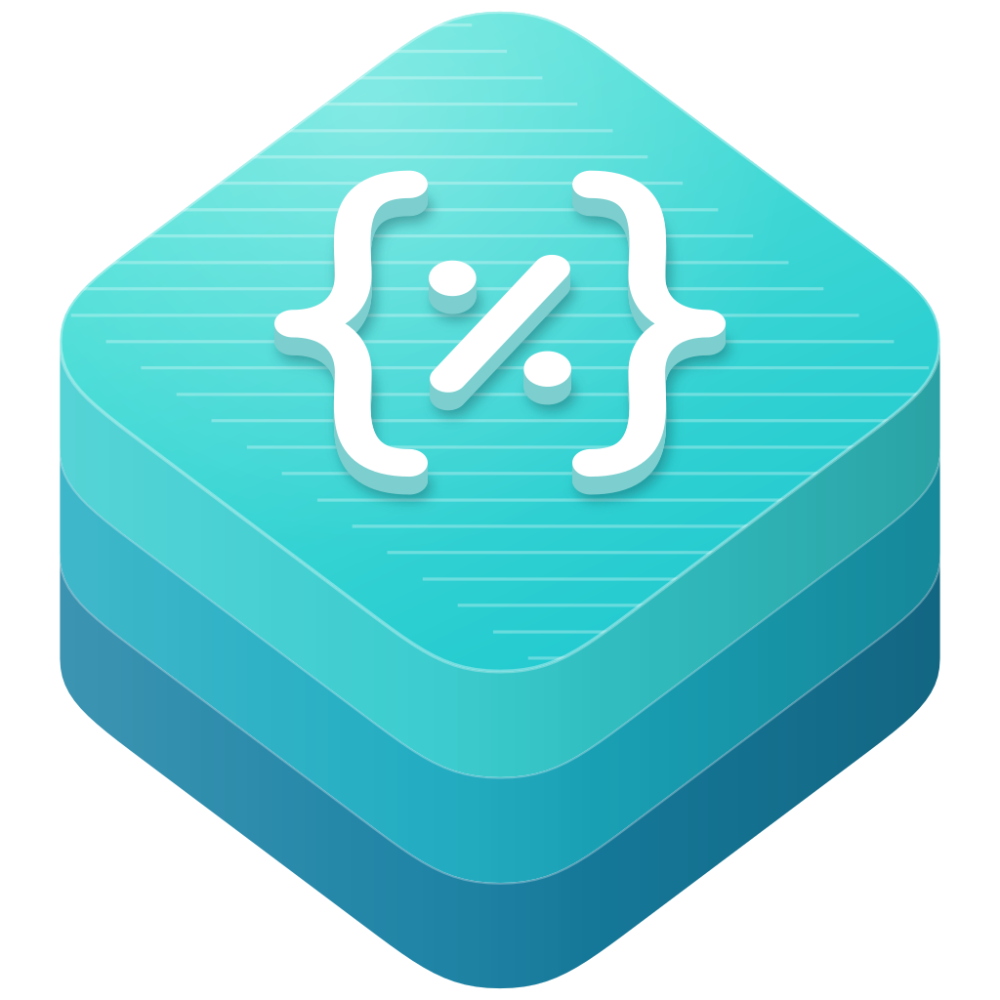

<p align="center">
  
</p>

<h1 align="center">swift-gyb</h1>

<p align="center">
  A SwiftPM build tool plugin that expands gyb templates into Swift sources and resources at build time.
</p>

<p align="center">
  <a href="https://github.com/swift-library/swift-gyb/actions/workflows/ci.yml"></a>
  
  
  <a href="LICENSE.txt"></a>
</p>

[Overview](#overview) · [Install](#install) · [Quick start](#quick-start) ·
[Usage](#usage) · [Requirements](#requirements) ·
[Documentation](#documentation) · [Contributing](#contributing) ·
[License](#license)

> [!NOTE]
> swift-gyb is pre-1.0. Minor releases may include breaking changes, so
> depend on it with `.upToNextMinor(from:)`.

## Overview

swift-gyb runs [gyb](https://github.com/swiftlang/swift/blob/main/utils/gyb.py),
the template tool the Swift project uses for repetitive standard library code,
as a SwiftPM build tool plugin. Add `GybPlugin` to a target, put `.gyb`
templates next to its sources, and every build expands them into the target.
Templates use Python for loops, conditions, and substitutions, so one list of
types can produce a family of declarations without checking generated code in.

- Expands every `.gyb` file in a Swift target as part of the build.
- Compiles `.swift.gyb` outputs into the target, with `#sourceLocation`
  directives that point compiler diagnostics at template lines.
- Passes the target's `.define` compilation conditions to templates.
- Keeps non-Swift outputs, such as `.txt.gyb` or `.html.gyb`, under their own
  extension and bundles them as target resources.
- Bundles `gyb.py`, so a build only needs Python 3.

## Install

Add the package to `Package.swift` and apply `GybPlugin` to each target that
contains templates:

```swift
dependencies: [
  .package(
    url: "https://github.com/swift-library/swift-gyb.git",
    .upToNextMinor(from: "0.1.0")
  ),
],
targets: [
  .target(
    name: "YourLibrary",
    plugins: [
      .plugin(name: "GybPlugin", package: "swift-gyb"),
    ]
  ),
]
```

The plugin works with library, executable, and test targets written in Swift.
It skips targets in other languages.

## Quick start

Create a package with one target that uses the plugin:

```swift
// swift-tools-version: 5.8

import PackageDescription

let package = Package(
  name: "Settings",
  dependencies: [
    .package(
      url: "https://github.com/swift-library/swift-gyb.git",
      .upToNextMinor(from: "0.1.0")
    ),
  ],
  targets: [
    .target(
      name: "Settings",
      plugins: [
        .plugin(name: "GybPlugin", package: "swift-gyb"),
      ]
    ),
  ]
)
```

Add a template at `Sources/Settings/Setting.swift.gyb`. It loops over one list
of types twice, once for the enum cases and once for the matching
initializers:

```swift
%{
  types = ['Bool', 'Int', 'Double', 'String']
}%
public enum Setting: Equatable {
% for type in types:
  case ${type.lower()}(${type})
% end
}

% for type in types:
extension Setting {
  public init(_ value: ${type}) {
    self = .${type.lower()}(value)
  }
}

% end
```

Ordinary Swift files in the same target can use the generated code. Add
`Sources/Settings/Setting+Description.swift`:

```swift
extension Setting: CustomStringConvertible {
  public var description: String {
    switch self {
    case .bool(let value): return String(value)
    case .int(let value): return String(value)
    case .double(let value): return String(value)
    case .string(let value): return value
    }
  }
}
```

Then build:

```bash
swift build
```

The plugin writes `Setting.swift` to its work directory under
`.build/plugins/outputs` and compiles it with the rest of the target.

A target needs at least one ordinary `.swift` file. If a target contains only
`.gyb` templates, SwiftPM does not recognize it as a Swift target and the
plugin never runs.

## Usage

### Template syntax

A gyb template is literal text with embedded Python:

- `%{ ... }%` runs a block of Python code, typically to define values for the
  rest of the template.
- Lines whose first non-blank character is `%`, such as
  `% for type in types:` and `% if condition:`, control which lines are
  emitted. Close each block with `% end`.
- `${expression}` inserts the result of a Python expression.
- `%%` and `$$` insert a literal `%` and `$`.
- Everything else is copied to the output unchanged.

`python3 gyb.artifactbundle/gyb.py --help` in this repository prints the full
syntax reference.

### Output files

Each template produces one file named after it without the `.gyb` suffix, so
`Setting.swift.gyb` becomes `Setting.swift` and `Guide.txt.gyb` becomes
`Guide.txt`. SwiftPM reruns a template when it changes, and generated files
stay in `.build`.

Templates in subdirectories have their relative path flattened with `__`:
`Models/User.swift.gyb` becomes `Models__User.swift`. Templates with the same
file name in different directories therefore produce separate outputs.

Outputs that end in `.swift` are compiled into the target. They include
`#sourceLocation` directives, so a compiler error points at the template line,
reported under the flattened template name, such as `Models__User.swift.gyb`.

Other outputs are written without line directives, and SwiftPM bundles them as
resources of the target. Read them through `Bundle.module` by their flattened
name. For `Docs/Notes.txt.gyb`:

```swift
let notes = Bundle.module.url(forResource: "Docs__Notes", withExtension: "txt")
```

### Compilation conditions

Conditions declared with `.define` in the target's `swiftSettings` reach every
template as a Python variable with the value `"1"`:

```swift
.target(
  name: "YourLibrary",
  swiftSettings: [
    .define("FEATURE_FLAGS"),
  ],
  plugins: [
    .plugin(name: "GybPlugin", package: "swift-gyb"),
  ]
)
```

```swift
% if FEATURE_FLAGS == "1":
public struct FeatureFlags {}
% end
```

Built-in conditions such as `DEBUG` are not passed. A template that refers to a
name the target does not define fails the build with a Python `NameError`, so
test an optional condition with `globals().get("NAME") == "1"`.

## Requirements

- Swift 5.8 or later.
- Python 3, available as `python3` on the build machine's `PATH`.
- macOS 12, iOS 15, tvOS 15, or watchOS 9 or later, or Linux. Packages with
  lower deployment targets can use 0.0.2.

CI builds and tests the plugin on macOS with Xcode 26 and on Linux with
Swift 6.2.

## Documentation

- [gyb.py](https://github.com/swiftlang/swift/blob/main/utils/gyb.py): the
  template engine in the Swift repository.
- [Swift GYB](https://nshipster.com/swift-gyb/) on NSHipster: a walkthrough of
  gyb templates in the Swift standard library.
- [Changelog](CHANGELOG.md)

## Contributing

Read [CONTRIBUTING.md](CONTRIBUTING.md) and the
[code of conduct](CODE_OF_CONDUCT.md) before opening a pull request. Before
submitting changes, run the same checks as CI:

```bash
Scripts/check
```

It runs the `gyb.py` self-test, the release-tool tests and `swift test`. The
tests use Swift Testing, so `swift test` needs a Swift 6 toolchain. Releases
follow the swift-library
[versioning standard](https://github.com/swift-library/.github/blob/master/VERSIONING.md).

## License

swift-gyb is available under the Apache License 2.0 with the Swift Runtime
Library Exception. See [LICENSE.txt](LICENSE.txt) and [NOTICE](NOTICE). The
bundled `gyb.artifactbundle/gyb.py` is
[`utils/gyb.py`](https://github.com/swiftlang/swift/blob/2f9445d55e84eec95d3e066299d8f4636a3e5af9/utils/gyb.py)
from the Swift project, which is distributed under the same license.
